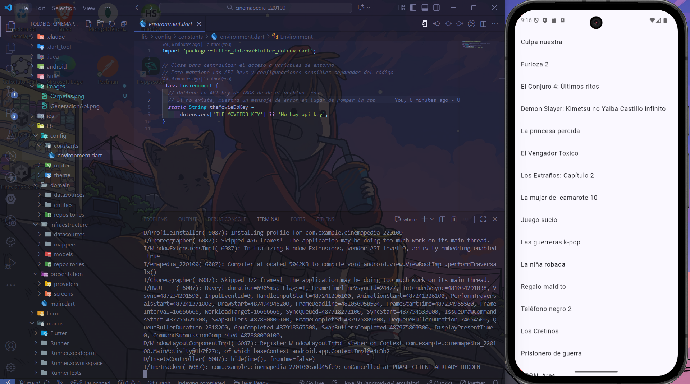
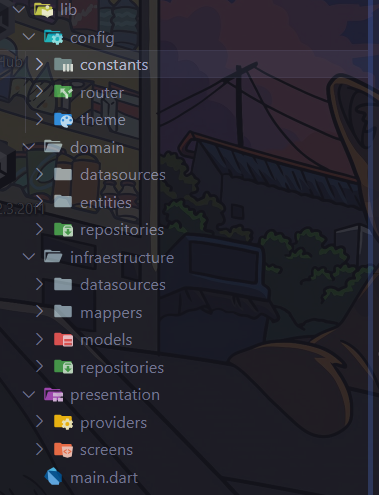
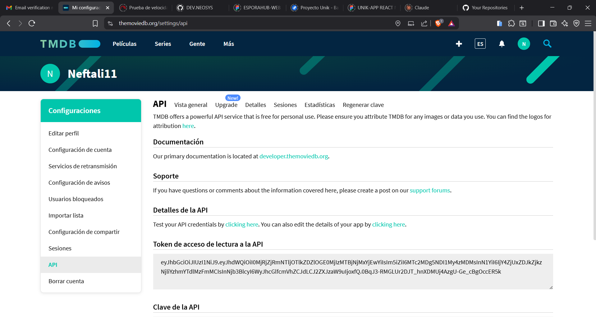

# 🎬 Cinemapedia - App de Películas

Una aplicación Flutter que muestra información de películas usando la API de The Movie Database (TMDB).

## 📱 Capturas de Pantalla

### App en Funcionamiento


### Estructura del Proyecto


### Configuración de API


## 🚀 Características

- ✅ Lista de películas en cartelera
- ✅ Integración con TMDB API
- ✅ Arquitectura limpia (Clean Architecture)
- ✅ Manejo de estado con Riverpod
- ✅ Navegación con Go Router
- ✅ Variables de entorno seguras

## 🛠️ Tecnologías Utilizadas

- **Flutter** 3.35.3
- **Dart** 3.9.2
- **Riverpod** - Manejo de estado
- **Dio** - Cliente HTTP
- **Go Router** - Navegación
- **Flutter DotEnv** - Variables de entorno

## 📋 Prerequisitos

Antes de comenzar, asegúrate de tener instalado:

- [Flutter SDK](https://flutter.dev/docs/get-started/install) (3.35.3 o superior)
- [Dart SDK](https://dart.dev/get-dart) (3.9.2 o superior)
- Un editor de código (VS Code, Android Studio)
- Git

## 🏗️ Creación del Proyecto

### 1. Crear Proyecto Flutter

```bash
flutter create cinemapedia_220100
cd cinemapedia_220100
```

### 2. Estructura de Carpetas

El proyecto sigue **Clean Architecture** con la siguiente estructura:

```
lib/
├── main.dart                          # Punto de entrada
├── config/                           # Configuraciones globales
│   ├── constants/
│   │   └── environment.dart          # Variables de entorno
│   ├── router/
│   │   └── app_router.dart           # Configuración de rutas
│   └── theme/
│       └── app_theme.dart            # Tema de la aplicación
├── domain/                           # Lógica de negocio
│   ├── entities/
│   │   └── movie.dart                # Entidad Movie
│   ├── datasources/
│   │   └── movies_datasource.dart    # Contrato para datos
│   └── repositories/
│       └── movies_repository.dart    # Contrato para repositorio
├── infrastructure/                   # Implementaciones externas
│   ├── datasources/
│   │   └── moviedb_datasource.dart   # Implementación TMDB API
│   ├── mappers/
│   │   └── movie_mapper.dart         # Conversión de datos
│   ├── models/
│   │   └── moviedb/                  # Modelos de TMDB
│   └── repositories/
│       └── movie_repository_impl.dart # Implementación repositorio
└── presentation/                     # UI y lógica de presentación
    ├── providers/                    # Estados globales
    │   └── movies/
    └── screens/                      # Pantallas de la app
        └── movies/
            └── home_screen.dart      # Pantalla principal
```

## 📦 Dependencias

### Agregar Dependencias

Ejecuta el siguiente comando para instalar todas las dependencias:

```bash
flutter pub add dio flutter_dotenv flutter_riverpod go_router cupertino_icons
```

### Dependencies en pubspec.yaml

```yaml
dependencies:
  flutter:
    sdk: flutter
  cupertino_icons: ^1.0.8
  dio: ^5.4.0                    # Cliente HTTP
  flutter_dotenv: ^5.1.0         # Variables de entorno
  flutter_riverpod: ^2.4.9       # Manejo de estado
  go_router: ^13.0.0             # Navegación

dev_dependencies:
  flutter_test:
    sdk: flutter
  flutter_lints: ^5.0.0

flutter:
  uses-material-design: true
  assets:
    - .env                       # Archivo de variables de entorno
```

## 🔑 Configuración de API Key

### 1. Obtener API Key de TMDB

1. Ve a [The Movie Database](https://www.themoviedb.org/)
2. Crea una cuenta gratuita
3. Ve a **Configuración → API**
4. Solicita una **API Key**
5. Copia tu **API Key v3**

### 2. Configurar Variables de Entorno

Crea un archivo `.env` en la raíz del proyecto:

```bash
THE_MOVIEDB_KEY=tu_api_key_aqui
```

**⚠️ IMPORTANTE**: El archivo `.env` está en `.gitignore` para proteger tu API key.

### 3. Archivo de Ejemplo

Se incluye `.env.example` como plantilla:

```bash
THE_MOVIEDB_KEY=your_api_key_here
```

## 🏃‍♂️ Cómo Ejecutar el Proyecto

### 1. Clonar el Repositorio

```bash
git clone https://github.com/Nefta11/cinemapedia_220100.git
cd cinemapedia_220100
```

### 2. Instalar Dependencias

```bash
flutter pub get
```

### 3. Configurar API Key

```bash
# Copia el archivo de ejemplo
cp .env.example .env

# Edita .env y agrega tu API key
THE_MOVIEDB_KEY=tu_api_key_de_tmdb
```

### 4. Ejecutar la Aplicación

```bash
flutter run
```

Selecciona el dispositivo donde quieres ejecutar:
- **1**: Windows (Escritorio)
- **2**: Edge (Web)
- **Dispositivo móvil**: Si tienes uno conectado

## 🏛️ Arquitectura del Proyecto

### Clean Architecture

La aplicación implementa **Clean Architecture** con tres capas principales:

#### 1. **Domain Layer** (Dominio)
- **Entities**: Modelos de datos puros (`Movie`)
- **Repositories**: Contratos para acceso a datos
- **Datasources**: Contratos para fuentes de datos

#### 2. **Infrastructure Layer** (Infraestructura)
- **Datasources**: Implementaciones reales (TMDB API)
- **Repositories**: Implementaciones de repositorios
- **Models**: Modelos específicos de APIs externas
- **Mappers**: Conversión entre modelos y entidades

#### 3. **Presentation Layer** (Presentación)
- **Screens**: Pantallas de la aplicación
- **Providers**: Manejo de estado con Riverpod
- **Widgets**: Componentes de UI

### Flujo de Datos

```
UI → Provider → Repository → Datasource → API
 ↓      ↓           ↓            ↓         ↓
Screen → State → Interface → Implementation → TMDB
```

## 🔧 Funcionalidades Principales

### 1. **Obtener Películas en Cartelera**
- Consume endpoint `/movie/now_playing` de TMDB
- Implementa paginación para cargar más películas
- Filtra películas sin póster

### 2. **Manejo de Estado**
- Usa **Riverpod** para estado global
- Implementa patrón **StateNotifier**
- Carga lazy de datos

### 3. **Manejo de Errores**
- Validación de API key
- Manejo de respuestas vacías
- Imágenes por defecto para pósters faltantes
